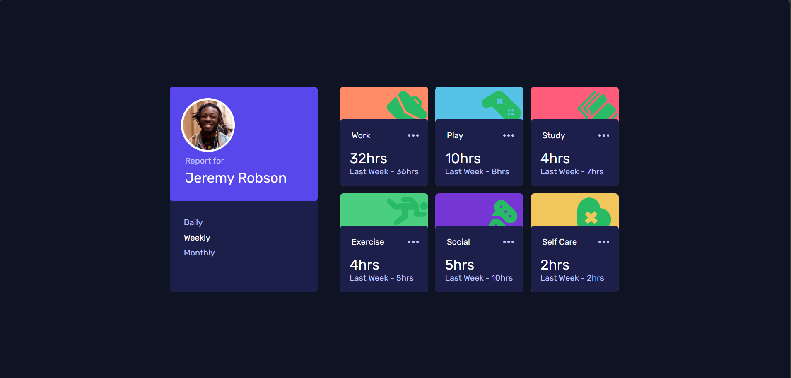

# Frontend Mentor - Time tracking dashboard solution

This is a solution to the [Time tracking dashboard challenge on Frontend Mentor](https://www.frontendmentor.io/challenges/time-tracking-dashboard-UIQ7167Jw). Frontend Mentor challenges help you improve your coding skills by building realistic projects. 

## Table of contents

  - [The challenge](#the-challenge)
  - [Screenshot](#screenshot)
  - [Links](#links)
  - [Built with](#built-with)
  - [Continued development](#continued-development)
  - [Useful resources](#useful-resources)
  - [Author](#author)

### The challenge

Users should be able to:

- View the optimal layout for the site depending on their device's screen size
- See hover states for all interactive elements on the page
- Switch between viewing Daily, Weekly, and Monthly stats

### Screenshot

 - Desktop Version
  - Mobile Version

### Links

- Solution URL: https://github.com/pranathi-cola/Ragam-Inductions
- Live Site URL: https://pranathi-cola.github.io/Ragam-Inductions/

### Built with

- Semantic HTML5 markup
- CSS custom properties
- Flexbox
- CSS Grid
- Mobile-first workflow
- [React](https://reactjs.org/) - JS library

### Continued development

I have mostly used flex in CSS and am not used to using media queries. I would like to focus more on those going further and I have found interest in working with css a lot. 

=
### Useful resources

- https://medium.com/ - This helped me with my doubts and is really useful as everything is explained clearly. I really liked this pattern and will use it going forward.
- https://www.theodinproject.com/ - This is an amazing platform to learn Web Development. Although I was using it even before starting the project, this website helped me learn how to build websites in an interactive way. I'd recommend it to anyone still learning this concept.
- https://stackoverflow.com/ - This helped me clear my doubts as I was building the website and it was really useful. I really like using this website and would recommend it to anyone who needs it.

## Author

- Github - https://github.com/pranathi-cola
- LinkedIn - https://www.linkedin.com/in/pranathi-k-aa3238329/
